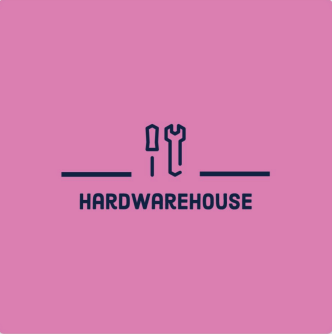

# Supplies under COVID-19 Restrictions

New Zealand has four [alert levels](AlertLevels.md "c:run") that specify the health and social measures to be taken to fight COVID-19. These are mandated by the [COVID-19 legislation](http://www.pco.govt.nz/covid-19-legislation/).

| Alert Level        | Risk                                |
|--------------------|-------------------------------------|
| Level 4 - Lockdown | Likely the disease is not contained |
| Level 3 - Restrict | Medium risk of community transmission - active but managed clusters |
| Level 2 - Reduce   | The disease is contained, but the risk of community transmission remains |
| Level 1 - Prepare  | The disease is contained in New Zealand |

Different parts of the country may be at different alert levels. We can move up and down alert levels.

Restrictions to supplies depend on the:

* alert levels in place (date of supply), 
* customer type (trade or public),
* customer address, and
* store address

When taking orders, we need to determine the [customer type and alert level](CustomerTypeAndAlertLevel.md "c:run") placing the order.

## What are the restrictions we need for the HardWareHouse site?

### Level 4

* [Level 4 Public customers](Level4Public.md "c:run")
* [Level 4 Trade customers](Level4Trade.md "c:run")

### Level 3

* [Level 3 Public customers](Level3Public.md "c:run")

